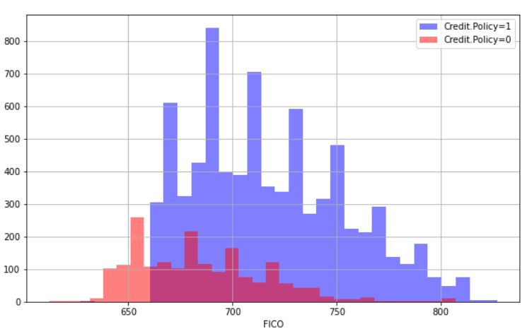
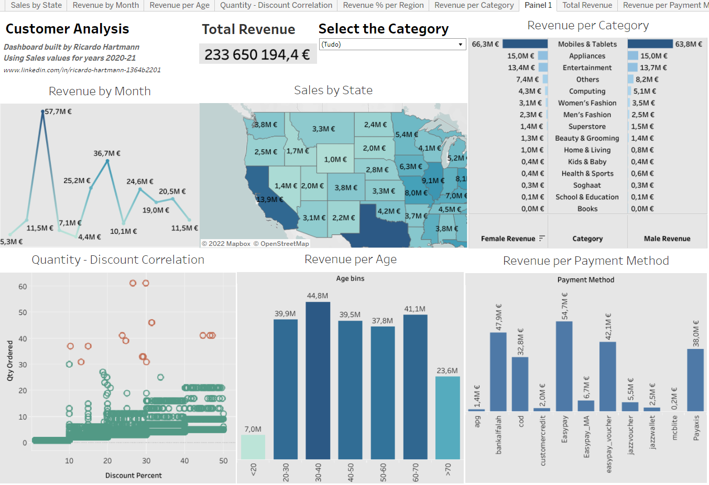

# Ricardo Portfolio
Building my Data Science Portfolio

# [Project 1: Data driven loan payment prediction](https://colab.research.google.com/drive/1UDw4jaXnPQ_eN0EyBdVQyTyonTmapbk3?usp=sharing)

* Project exploring publicly available data from LendingClub.com from 2007 to 2010 as a csv file.
* This project starts with data exploration and visualization to better understand the imported data.
* The statistical data analysis envolved Descriptive analysis (univariate analysis), Correlation analysis (bivariate analysis) going through Qualitative analysis and Quantitative analysis
* Data is cleaned to be prepared to be applied some scikit learn models.
* Created two models using decision trees and random forest to help predict.
* Presented the classification report and confusion matrix.

# [Project 2: Customer Analysis Dashboard using Tableau](https://public.tableau.com/views/CustomerAnalysisusingsalesdata/Painel1?:language=pt-BR&:display_count=n&:origin=viz_share_link)

* This dashboard was created using sales dataset for 2021 and 2022
* The main questions I was looking for to answer with this dashboard build were: 
* Revenue per state | Revenue based on month of the year | Revenue based on customer age | Revenue per category per gender and finaly Revenue per payment method.
* I decided to apply filters to choose between multiple cathegories for easy comparison and also display the total revenue value

# [Project 3: SQL Analysis of a Walmart retail dataset](https://github.com/hartmann-pereira/SQL-campaign/blob/main/SQLite.sql)

* This SQL file contains queries about a walmart retail dataset between 2012 and 2015
* Built by transforming a xlsx file into a csv file and uploading into sqloteonline.com and querying the data
* Skills used: select, select distinct, where, and/or, order by, min/max/average/sum/count, aliases, group by, subquery
* Dataset consisted of 25 columns and around 8400 rows having text, numbers values and also null values
* In the initial queries my objective was to get to know the dataset that was being used
* Looking into the data and answering kpi questions such as average total revenue
* Moved into queries that provide deeper understanding such as % of profits per client segment
* Showing a comparison of average company profit between consumer and corporate customers
* More advanced techniques were used such as sub-query and calculations 
